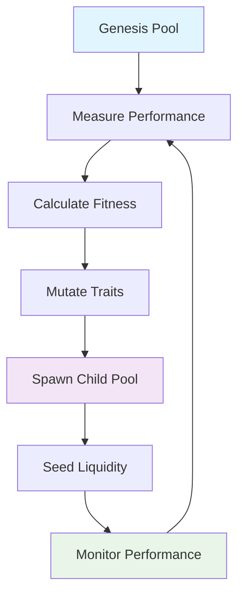

# 🧬 Morpheus Protocol

<div align="center">


**Revolutionary Evolutionary AMM Protocol**

*Demonstrating on-chain "evolution" of liquidity pools through trait mutation and lineage tracking*

[🚀 Live Demo](http://localhost:5173) • [📖 Documentation](#documentation) • [🔧 Quick Start](#quick-start) • [🧪 Testing](#testing)

</div>

## 🌟 Overview

Morpheus Protocol is a groundbreaking DeFi innovation that introduces **evolutionary algorithms** to Automated Market Makers (AMMs). Unlike traditional AMMs with static parameters, Morpheus pools can "evolve" by spawning child pools with mutated traits based on performance metrics.

### 🎯 Key Features

- **🧬 Evolutionary AMM**: Pools spawn children with mutated traits (fees, slippage protection, cooldowns)
- **📊 Performance-Based Selection**: Evolution driven by real metrics (volume, fees, price impact)
- **🔗 Cross-Chain DNA**: Export/import pool genetics across multiple chains
- **🛡️ Production-Ready Security**: Immutable contracts with comprehensive guardrails
- **🎨 Modern Frontend**: React + Vite dashboard with real-time visualization
- **⚡ Zero-Budget Stack**: Built entirely on free/open-source tools

## 🏗️ Technical Architecture

### Smart Contracts

```
📁 contracts/
├── 🧬 EvolvablePool.sol     # Core AMM with evolutionary traits
├── 🏭 PoolFactory.sol       # Deploys pool clones via EIP-1167
├── 📋 Registry.sol          # Lineage tracking & pool enumeration
├── 🔧 MorpheusFactory.sol   # Cross-chain DNA operations
└── 📊 Types.sol             # Shared data structures
```

### Frontend Dashboard

```
📁 frontend/
├── 🎨 src/components/       # React UI components
├── 🔗 src/hooks/           # Web3 integration hooks
├── 📡 src/abi/             # Contract ABIs
└── ⚙️ src/config/          # Network configurations
```

### Deployment Scripts

```
📁 scripts/
├── 🚀 deploy.ts            # Full deployment pipeline
├── 🎭 simulate.ts          # Generate realistic trading activity
├── 🧬 evolve.ts            # Spawn evolved child pools
├── 📤 exportDNA.ts         # Cross-chain DNA export
└── 📥 importDNA.ts         # Cross-chain DNA import
```
- **test/e2e.spec.ts**: End-to-end test: deploy → swap → evolve → lineage checks.
- **test/comprehensive.spec.ts**: Comprehensive test suite covering all functionality.
- **test/morpheus.factory.spec.ts**: Factory contract testing and validation.

## 🛡️ Security & Governance

### Built-in Guardrails
- ✅ **Fee Limits**: Maximum 10% (1000 bps) trading fees
- ✅ **Slippage Protection**: Configurable up to 20% maximum
- ✅ **MEV Mitigation**: Same-block protection and cooldown periods
- ✅ **Emergency Controls**: Owner-gated pause functionality

### Audit & Transparency
- 🔍 **On-Chain Lineage**: Complete evolution history tracked
- 📊 **Public Metrics**: All performance data queryable
- 🔒 **Immutable Core**: Pool logic cannot be modified post-deployment
- ⚡ **CI Security**: Automated Slither and Mythril analysis

## 💰 Zero-Budget Technology Stack

| Component | Technology | Cost |
|-----------|------------|------|
| 🔗 **Blockchain** | Polygon Amoy Testnet | Free |
| 💻 **Smart Contracts** | Solidity 0.8.24 + OpenZeppelin v5 | Free |
| 🛠️ **Development** | Hardhat + Ethers v6 | Free |
| 🎨 **Frontend** | React 18 + Vite + Tailwind CSS | Free |
| 🌐 **Deployment** | Netlify/Vercel | Free Tier |
| 🔍 **Security** | Slither + Mythril | Free |

**Total Development Cost: $0** 💸

## 🔧 Quick Start

### Prerequisites
- Node.js 18+ 
- Git
- MetaMask or compatible Web3 wallet

### Installation

```bash
# Clone the repository
git clone https://github.com/yourusername/morpheus-protocol.git
cd morpheus-protocol

# Install dependencies
npm install
cd frontend && npm install && cd ..

# Configure environment
cp .env.example .env
```

### Environment Configuration

Edit `.env` with your settings:

```bash
# Required for testnet deployment
PRIVATE_KEY=0x...  # Your funded testnet private key

# RPC Endpoints (defaults provided)
AMOY_RPC_URL=https://rpc-amoy.polygon.technology
BASE_SEPOLIA_RPC_URL=https://sepolia.base.org
ARBITRUM_SEPOLIA_RPC_URL=https://sepolia-rollup.arbitrum.io/rpc

# Optional API Keys for verification
POLYGONSCAN_KEY=your_polygonscan_key
BASESCAN_API_KEY=your_basescan_key
ARBISCAN_API_KEY=your_arbiscan_key
```

### 🚀 One-Click Demo Setup

```bash
# Start complete demo environment
.\scripts\start-demo.ps1
```

This script will:
1. ✅ Start local Hardhat node
2. ✅ Deploy all contracts
3. ✅ Seed initial liquidity
4. ✅ Generate sample trading activity
5. ✅ Launch frontend dashboard

**Demo URL**: http://localhost:5173

## 🧪 Testing

### Compile Contracts
```bash
npm run compile
```

### Run Test Suite
```bash
# Run all tests
npm test

# Run specific test files
npx hardhat test test/comprehensive.spec.ts
npx hardhat test test/e2e.spec.ts
```

### Local Development
```bash
# Deploy to local Hardhat network
npm run deploy

# Generate trading activity
npm run simulate

# Create evolved child pools
npm run evolve
```

## 🌐 Testnet Deployment

### Polygon Amoy Testnet

```bash
# Deploy complete protocol
npm run deploy:amoy

# Generate realistic trading activity
npm run simulate

# Spawn evolved child pools
npm run evolve
```

### Multi-Chain Deployment

```bash
# Deploy to Base Sepolia
npm run deploy:base

# Deploy to Arbitrum Sepolia  
npm run deploy:arb
```

### Cross-Chain Evolution

```bash
# Evolve from Amoy to Base Sepolia
npm run orchestrate:amoy-base

# Evolve from Amoy to Arbitrum Sepolia
npm run orchestrate:amoy-arb
```

> 📝 All deployments are tracked in `deployments.json` and `deployments.multi.json`

## 🎨 Frontend Dashboard

### Development
```bash
# Start development server
npm run web:dev

# Build for production
npm run web:build

# Preview production build
npm run web:preview
```

### Features
- 🔗 **Wallet Integration**: MetaMask, WalletConnect support
- 📊 **Pool Visualization**: Real-time metrics and lineage trees
- 🧬 **Evolution Controls**: Spawn child pools with mutated traits
- 💰 **Liquidity Management**: Add/remove liquidity interface
- 🔄 **Trading Interface**: Swap tokens with slippage protection
- 📈 **Analytics Dashboard**: Performance metrics and evolution history

### Usage Guide
1. **Connect Wallet**: Click "Connect Wallet" and approve connection
2. **Load Protocol**: Enter Registry and Factory addresses from `deployments.json`
3. **Explore Pools**: View pool metrics, lineage, and performance data
4. **Execute Trades**: Swap tokens with real-time price impact calculation
5. **Evolve Pools**: Create child pools with optimized traits
6. **Manage Liquidity**: Add/remove liquidity as pool owner

### Deployment
The frontend builds to `frontend/dist/` and supports:
- 🌐 **Netlify**: Configured via `netlify.toml`
- ⚡ **Vercel**: Configured via `vercel.json`
- 📦 **Static Hosting**: Any CDN or web server

## 🔗 Cross-Chain Evolution

### Supported Networks

| Network | Chain ID | Testnet | Faucet |
|---------|----------|---------|--------|
| 🟣 **Polygon Amoy** | 80002 | ✅ | [Faucet](https://faucet.polygon.technology/) |
| 🔵 **Base Sepolia** | 84532 | ✅ | [Faucet](https://www.coinbase.com/faucets/base-ethereum-goerli-faucet) |
| 🟠 **Arbitrum Sepolia** | 421614 | ✅ | [Faucet](https://bridge.arbitrum.io/) |

### Cross-Chain Orchestration

The protocol supports seamless evolution across chains:

```bash
# Cross-chain evolution examples
npm run orchestrate:amoy-base      # Amoy → Base Sepolia
npm run orchestrate:amoy-arb       # Amoy → Arbitrum Sepolia  
npm run orchestrate:base-arb       # Base Sepolia → Arbitrum Sepolia
```

### DNA Export/Import Process

1. **📊 Fitness Evaluation**: Analyze parent pool performance
2. **🧬 Trait Mutation**: Generate optimized child traits
3. **📤 DNA Export**: Encode genetics to portable format
4. **🌉 Cross-Chain Transfer**: Manual or automated relay
5. **📥 DNA Import**: Deploy child pool on target chain
6. **💰 Liquidity Seeding**: Initialize child pool with funds

### Output Files
- `deployments.multi.json`: Multi-chain deployment registry
- `out/dna_<pool>_<chainId>.hex`: Exported genetic data
- Evolution lineage tracked across all chains

## 🧬 Evolution Mechanism

### How Pool Evolution Works

Morpheus Protocol implements **safe evolutionary algorithms** without self-modifying code:



### Evolutionary Process

1. **📊 Performance Measurement**
   - Trading volume and frequency
   - Fee collection efficiency  
   - Price impact minimization
   - Gas optimization metrics

2. **🧮 Fitness Calculation**
   - Multi-objective optimization
   - Weighted performance scoring
   - Pareto frontier analysis
   - Historical trend evaluation

3. **🎲 Trait Mutation**
   - Fee rate optimization (0.01% - 10%)
   - Slippage protection tuning (0% - 20%)
   - Cooldown period adjustment (0 - 1000 blocks)
   - MEV protection configuration

4. **🏭 Child Pool Deployment**
   - EIP-1167 minimal proxy clones
   - Immutable core logic
   - Configurable parameters only
   - Automatic registry enrollment

5. **💰 Liquidity Migration**
   - Gradual liquidity shifting
   - Performance-based routing
   - Natural selection pressure
   - Ecosystem optimization

### Safety Guarantees

- ✅ **Immutable Core**: Pool logic cannot be changed
- ✅ **Bounded Mutations**: All parameters have strict limits
- ✅ **Gradual Evolution**: No sudden dramatic changes
- ✅ **Reversible Process**: Can always return to parent traits
- ✅ **Transparent History**: Complete lineage tracking on-chain

## 🔒 Security & CI/CD

### Automated Security Analysis

```yaml
# .github/workflows/security.yml
Security Pipeline:
  ✅ Slither Static Analysis
  ✅ Mythril Symbolic Execution  
  ✅ Gas Usage Reporting
  ✅ Dependency Vulnerability Scanning
  ✅ Code Coverage Analysis
```

### Security Tools

| Tool | Purpose | Trigger |
|------|---------|----------|
| 🔍 **Slither** | Static analysis | Every PR/Push |
| 🧙 **Mythril** | Symbolic execution | Every PR/Push |
| ⛽ **Gas Reporter** | Optimization | `REPORT_GAS=1` |
| 🛡️ **OpenZeppelin** | Secure contracts | Always |

### Manual Security Review

- 📋 **Access Controls**: Owner-only functions properly protected
- 🔒 **Reentrancy**: CEI pattern enforced throughout
- 💰 **Integer Overflow**: SafeMath and Solidity 0.8+ protections
- 🎯 **Front-running**: MEV protection mechanisms active
- ⏸️ **Emergency Stops**: Pause functionality for critical issues

## 🚀 Production Deployment

### Frontend Deployment Options

#### Netlify Deployment
```bash
# Build and deploy
npm run web:build

# Deploy to Netlify (configured via netlify.toml)
netlify deploy --prod --dir=frontend/dist
```

#### Vercel Deployment  
```bash
# Build and deploy
npm run web:build

# Deploy to Vercel (configured via vercel.json)
vercel --prod
```

#### Manual Static Hosting
```bash
# Build static files
npm run web:build

# Upload frontend/dist/ to any CDN or web server
# Ensure SPA fallback routes to index.html
```

### Smart Contract Deployment

#### Mainnet Preparation
```bash
# Update hardhat.config.ts with mainnet settings
# Set production private key and RPC URLs
# Verify sufficient ETH for deployment gas

# Deploy to mainnet (when ready)
npm run deploy:mainnet
```

#### Contract Verification
```bash
# Verify on Etherscan/Polygonscan
npx hardhat verify --network mainnet <CONTRACT_ADDRESS>
```

## 🗺️ Roadmap

### Phase 1: MVP ✅ (Current)
- ✅ Core evolutionary AMM implementation
- ✅ Single-chain pool evolution
- ✅ Basic frontend dashboard
- ✅ Security auditing pipeline
- ✅ Cross-chain DNA export/import

### Phase 2: Advanced Evolution 🚧 (Q1 2024)
- 🔄 **Multi-Parent Crossover**: Combine traits from multiple successful pools
- 📊 **Pareto Optimization**: Multi-objective fitness landscapes
- 🤖 **ML-Enhanced Mutation**: Machine learning guided trait evolution
- 📈 **Advanced Analytics**: Comprehensive performance dashboards

### Phase 3: Ecosystem Growth 📋 (Q2 2024)
- 🌐 **Mainnet Deployment**: Production launch on Ethereum/Polygon
- 🔀 **Strategy Router**: Intelligent order flow routing
- 🏆 **Governance Token**: Community-driven protocol evolution
- 🤝 **DeFi Integrations**: Composability with major protocols

### Phase 4: Research & Innovation 🔬 (Q3-Q4 2024)
- 🧠 **Neural Pool Networks**: AI-driven liquidity optimization
- ⚡ **Layer 2 Expansion**: Deploy across all major L2s
- 🔮 **Predictive Evolution**: Anticipatory trait optimization
- 🌍 **Cross-Chain Bridges**: Seamless multi-chain evolution

## 📚 Documentation

### For Developers
- 📖 [Smart Contract Documentation](./docs/contracts.md)
- 🔧 [API Reference](./docs/api.md)
- 🧪 [Testing Guide](./docs/testing.md)
- 🚀 [Deployment Guide](./DEPLOYMENT_GUIDE.md)

### For Users
- 🎯 [User Guide](./docs/user-guide.md)
- 💡 [Evolution Tutorial](./docs/evolution-tutorial.md)
- ❓ [FAQ](./docs/faq.md)
- 🆘 [Troubleshooting](./docs/troubleshooting.md)

## 🤝 Contributing

We welcome contributions! Please see our [Contributing Guide](./CONTRIBUTING.md) for details.

### Development Setup
```bash
# Fork and clone the repository
git clone https://github.com/yourusername/morpheus-protocol.git

# Create a feature branch
git checkout -b feature/amazing-feature

# Make your changes and test
npm test

# Submit a pull request
```

### Bug Reports
Please use our [Issue Template](.github/ISSUE_TEMPLATE.md) for bug reports.

## 📄 License

This project is licensed under the MIT License - see the [LICENSE](./LICENSE) file for details.

## 🙏 Acknowledgments

- **The DeFi Community** for providing inspiration and feedback
- **OpenZeppelin** for secure smart contract foundations  
- **Hardhat** for excellent development tooling
- **React & Vite** for modern frontend capabilities

---

<div align="center">

**Built with ❤️ for the DeFi Community**

*Evolving the future of DeFi, one pool at a time* 🧬

</div>
